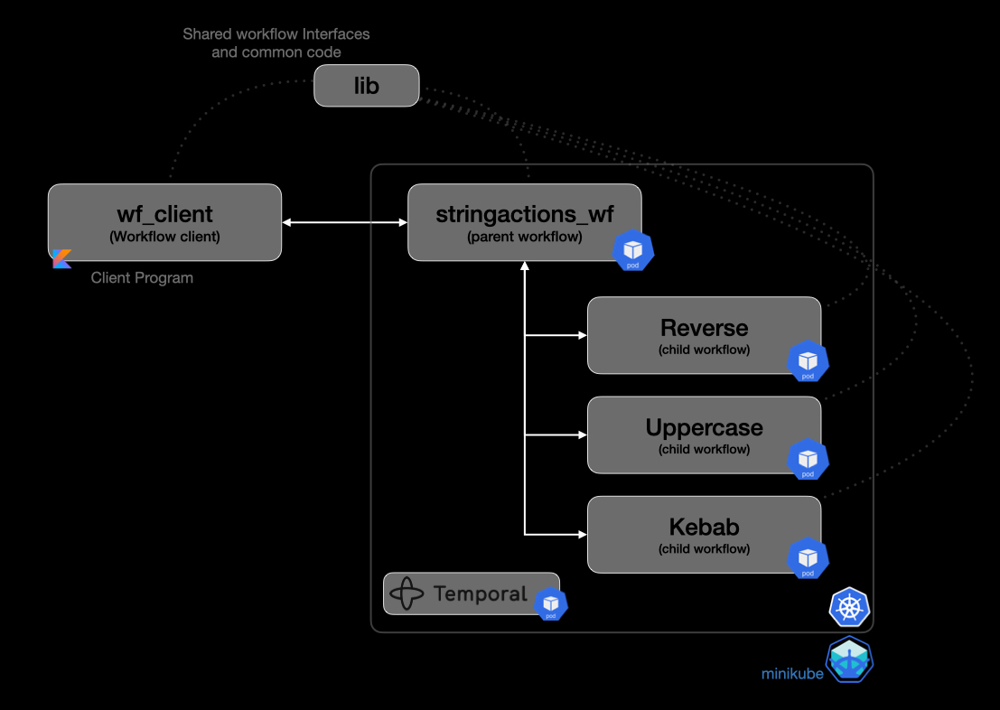

# temporal_workflow_kubernetes

Temporal workflow sample code base using Quarkus + Kotlin + Kubernetes.  
Uses Temporal Parent child workflows, remote and local activities.  
Using skaffold.dev for kubernetes.
It uses Gradle sub projects, with each project has its on Docker image and run as independent workflow

### Projects



#### Lib

  Contains common classes and interfaces, it also contains common code for registering, starting Workers, register activities etc
  Gradle build for this subproject copy the "jar" to each subfolder even-though each Gradle project has dependencies to ":lib" project,
  This is done to support Docker build to copy the "libs.jar" to Docker image, as Docker copy was not working from parent directory

#### Stringactions-wf

 This project contains the "Parent Workflow" which intern calls the child workflows (below).
 This workflow code demonstrate a different ways of calling the child workflows

- async
    Use of Async function and trigger child workflows dynamically

    ```kotlin
    Async.function({ value: String? -> workflow1.transform(value!!) }, input)
    ```

- dynamic
  invoke child workflow dynamically from a list of Workflow interfaces

- static
 hardcoded child workflow trigger one after another

#### reverse

 Workflow to do String reverse functionality

#### kebab

 Workflow to do change the string to "kebab" case (like "kebab-case-example" )
 This workflow shows the use of a local Activity

#### uppercase

 Wokflow to change the given string to upper case, without using an activity

#### wf_client

  Simple kotlin class to trigger the workflow by sending a random string to Temporal main Parent workflow Q

```kotlin
fun main(args: Array<String>) {
    val service: WorkflowServiceStubs = WorkflowServiceStubs.newLocalServiceStubs()
    val client: WorkflowClient = WorkflowClient.newInstance(service)
    val options: WorkflowOptions = WorkflowOptions.newBuilder()
        .setWorkflowId("string-actions-wf")
        .setTaskQueue("string-action-q")
        .build()
    val workflow: StringActionsWorkflow = client.newWorkflowStub(StringActionsWorkflow::class.java, options)

    val stringval: String = seedData[Random.nextInt(seedData.size)]
    val result: Array<String> = workflow.transform(stringval, "static")

    val workflowId: String = WorkflowStub.fromTyped<Any>(workflow).execution.workflowId
    println("[ $workflowId ] : $stringval => ${result.contentToString()}")
}
```

### Prerequisites

- Kotlin
- Quarkus
- Skaffold
- Temporal
- Minikue
- kubectl
- Docker

Follow the instructions here to set up Temporal
<https://github.com/temporalio/helm-charts>

start minikube

```shell
minikube start 
```

CD to the Temporal Helm Chart folder and run the below command to deploy temporal servers
Deploy Temporal (if its not already done)
<https://github.com/temporalio/helm-charts>

```shell
helm install \
    --set server.replicaCount=1 \
    --set cassandra.config.cluster_size=1 \
    --set prometheus.enabled=false \
    --set grafana.enabled=false \
    --set elasticsearch.enabled=false \
    temporaltest . --timeout 15m
```

After Temporal service are deployed , run port-forwards to access temporal services from local host

To access the Temporal Admin UI

```shell
kubectl port-forward services/temporaltest-web 8080:8080
```

To access temporal frontend, required to run the Temporal workflow client locally

```shell
kubectl port-forward services/temporaltest-frontend-headless 7233:7233
```

Check the running Temporal pods and services
Get all running pods

```shell
kubectl get pods
```

list the running services

```shell
kubectl get svc
```

Once all the environments are initialized, build and deploy workflows

To build all workflows

```shell
./gradlew build  
```

This will build all projects, lib, parent and child workflows, workflow client

Run skaffold to build docker images and deploy pods (using 'dev' profile)

```shell
skaffold dev -p dev
```

Once all workflow images are deployed, run "get pods" to check if all pods are in running condition

Now run the temporal String action workflow client

```shell
./gradlew :wf_client:run
```
